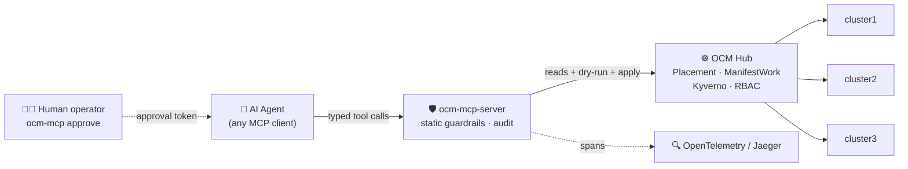

<div align="center">


# 🛡️ ocm-mcp-server

### AgentOps for Kubernetes fleets, done safely.

**An MCP server that lets AI agents operate a multi-cluster Kubernetes fleet through an
[Open Cluster Management](https://open-cluster-management.io/) hub, with policy, approval,
and audit between the model and your clusters.**

*The agent never holds a kubeconfig. Every write is policy-checked, human-approved, and traced.*

[](LICENSE)
[](pyproject.toml)
[](https://modelcontextprotocol.io/)
[](https://open-cluster-management.io/)
[](https://kyverno.io/)
[](https://github.com/sandeepbazar/ocm-mcp-server/actions)
[](https://github.com/sandeepbazar/ocm-mcp-server/releases)

[](https://www.linkedin.com/in/sandeepbazar/)
[](https://www.youtube.com/@techhorizonhub)

### [Architecture](docs/architecture.md) &nbsp;·&nbsp; [Deployment Guide](docs/deployment.md) &nbsp;·&nbsp; [Wiki](https://github.com/sandeepbazar/ocm-mcp-server/wiki) &nbsp;·&nbsp; [Examples](docs/examples.md) &nbsp;·&nbsp; [Guardrails](docs/guardrails.md)

**[✨ Why](#why-this-exists) &nbsp;·&nbsp; [🧭 Architecture](#architecture) &nbsp;·&nbsp; [🧰 Toolsets](#toolsets) &nbsp;·&nbsp; [🛠️ Tools](#tools) &nbsp;·&nbsp; [💬 Prompts](#prompts) &nbsp;·&nbsp; [🚀 Quickstart](#quickstart-laptop-15-minutes) &nbsp;·&nbsp; [📚 Docs](#documentation)**


<sub>The whole safe-remediation loop: investigate with free reads, propose a change, get rejected by the guardrails and correct it, wait for a human-signed token, apply, verify, and report from the audit log.</sub>

</div>

---

## Why this exists

Your team runs many Kubernetes clusters. Sooner or later somebody asks the question:
can an AI agent take the 2 a.m. page?

The quickest way to find out is to hand a model `kubectl` with cluster-admin and watch.
In production that experiment ends badly, for three separate reasons:

- **The model is non-deterministic.** The same alert can produce a careful diagnosis one
  run and a `kubectl delete` the next.
- **The credentials are real.** There is no dry run between the model's decision and your
  production cluster.
- **There is no record.** When something breaks, you cannot reconstruct what the agent did,
  in what order, or on whose authority.

This project starts from a different observation: fleets already have a control point that
humans trust every day, the multi-cluster hub. Open Cluster Management (a CNCF project)
gives every fleet an inventory (`ManagedCluster`), a scheduler (`Placement`), and a delivery
channel (`ManifestWork`). `ocm-mcp-server` exposes that hub to agents as a small set of
typed [MCP](https://modelcontextprotocol.io/) tools, and puts four independent layers
between the model and your clusters:

| # | Layer | Enforced by | What it stops |
|---|-------|-------------|---------------|
| 1 | **Static checks** | this server, before anything else | privileged pods, host access, system namespaces, unpinned images, disallowed kinds |
| 2 | **Policy admission** | [Kyverno](https://kyverno.io/) dry-run on the hub | anything your org's policies reject, evaluated inside the `ManifestWork` envelope |
| 3 | **Human approval** | HMAC token minted by `ocm-mcp approve` on a trusted terminal | any change reaching a cluster without a person consenting to that exact content |
| 4 | **Least-privilege RBAC** | Kubernetes | everything else; no Secrets, no exec, no deletes outside its own ManifestWorks |

None of these layers live in the system prompt, so none of them can be talked out of.

<div align="center">

</div>

## Architecture



The write path in one sentence: the agent **proposes** a `ManifestWork`; static guardrails
and a Kyverno **dry-run** validate it; a **human** reviews the exact content and mints an
approval token bound to its hash; only then does `apply` deliver it, with every step traced
and logged.

## Toolsets

The surface is **27 tools across nine toolsets**. Almost all of it is read: the
whole Open Cluster Management API is safe to inspect. Only two toolsets can change
anything, and only through the propose -> approve -> apply gate.

| Toolset | What it covers | Tools | Writes |
|---|---|---|---|
| **inventory** | ManagedClusters, ClusterSets, set bindings, ClusterClaims | 5 | - |
| **observability** | cluster health, events, pod logs | 3 | - |
| **placement** | Placements, PlacementDecisions, AddOnPlacementScores | 3 | - |
| **work** | ManifestWork status feedback + the gated deploy flow | 6 | gated |
| **addons** | ClusterManagementAddOns, per-cluster add-on health | 2 | - |
| **registration** | pending join CSRs + gated cluster lifecycle actions | 3 | gated |
| **policy** | governance policy compliance (if the add-on is installed) | 1 | - |
| **resources** | generic get/list over an allow-list of OCM API types | 2 | - |
| **audit** | pending proposals, this server's own audit trail | 2 | - |

Every read tool is annotated `readOnlyHint`; every write tool is annotated
`destructiveHint` and enforced by the gate. Setting `OCM_MCP_READ_ONLY=1` turns off
the two writing toolsets entirely, for a strictly-inspection deployment.

<div align="center">

</div>

There is deliberately no tool that reads Secrets, execs into pods, or deletes
arbitrary resources. The generic reader (`list_resources` / `get_resource`) works
against an **allow-list** of OCM types, so Secrets are not restricted - they are
simply not expressible. A capability that does not exist cannot be prompt-injected
into use.

## Tools

Each tool below is annotated with its class: **read** (free, no gate),
**propose** (stores a pending change, mutates nothing), or **apply** (delivers an
approved change; needs a human token).

<details>
<summary><b>inventory</b> - who is in the fleet</summary>

- **`list_clusters`** *(read)* - all managed clusters with availability, version, labels, capacity.
- **`get_cluster`** *(read)* - full view of one cluster.
  - `cluster` (string) - managed cluster name.
- **`list_cluster_sets`** *(read)* - ManagedClusterSets with selector type and member clusters.
- **`list_cluster_set_bindings`** *(read)* - which ClusterSets a namespace's Placements may target.
  - `namespace` (string, optional) - limit to one namespace; empty lists all.
- **`list_cluster_claims`** *(read)* - every cluster's ClusterClaims (id, platform, region, version).
</details>

<details>
<summary><b>observability</b> - why a cluster is unhealthy</summary>

- **`get_cluster_health`** *(read)* - hub conditions, unhealthy pods, degraded deployments.
  - `cluster` (string) - managed cluster name.
- **`query_events`** *(read)* - recent Kubernetes events, newest first.
  - `cluster` (string) - managed cluster name.
  - `namespace` (string, optional) - namespace filter; empty means all.
  - `limit` (int, optional) - max events (default 40).
- **`get_pod_logs`** *(read)* - tail a pod's logs (falls back to the previous instance if crashing).
  - `cluster` (string), `namespace` (string), `pod` (string) - target.
  - `container` (string, optional) - container name; empty picks the default.
  - `lines` (int, optional) - trailing lines (default 80).
</details>

<details>
<summary><b>placement</b> - which clusters were chosen, and why</summary>

- **`list_placements`** *(read)* - Placements and how many clusters each selects.
  - `namespace` (string, optional) - limit to one namespace.
- **`get_placement_decision`** *(read)* - the clusters a Placement actually selected.
  - `placement` (string) - Placement name.
  - `namespace` (string) - the Placement's namespace.
- **`list_addon_placement_scores`** *(read)* - custom scores prioritizers consume.
  - `cluster` (string) - managed cluster name.
</details>

<details>
<summary><b>work</b> - what the hub is delivering, and the gated deploy flow</summary>

- **`list_manifestworks`** *(read)* - ManifestWorks targeting a cluster.
  - `cluster` (string) - managed cluster name.
- **`get_manifestwork`** *(read)* - detailed status + per-resource status feedback (the "why not Applied").
  - `cluster` (string), `name` (string) - target.
- **`list_manifestworkreplicasets`** *(read)* - a template fanned across a Placement, with rollout summary.
  - `namespace` (string, optional) - limit to one namespace.
- **`propose_manifestwork`** *(propose)* - propose a change as a ManifestWork. Applies nothing.
  - `cluster` (string) - target cluster.
  - `name` (string) - short kebab-case ManifestWork name.
  - `summary` (string) - one or two sentences the human approver reads.
  - `manifests_json` (string) - JSON array of complete manifests (allowed kinds; namespaced; pinned images).
- **`apply_manifestwork`** *(apply)* - deliver an approved ManifestWork.
  - `proposal_id` (string), `approval_token` (string) - from `ocm-mcp approve <id>`.
- **`rollback_manifestwork`** *(apply)* - delete the ManifestWork from an applied proposal (needs a fresh token).
  - `proposal_id` (string), `approval_token` (string).
</details>

<details>
<summary><b>addons</b> - add-on health across the fleet</summary>

- **`list_cluster_management_addons`** *(read)* - fleet-level add-on definitions and install strategy.
- **`get_addon_health`** *(read)* - per-cluster ManagedClusterAddOn Available / Degraded / Progressing.
</details>

<details>
<summary><b>registration</b> - onboarding and cluster lifecycle (gated)</summary>

- **`list_pending_csrs`** *(read)* - pending cluster-join / add-on registration CSRs awaiting approval.
- **`propose_cluster_action`** *(propose)* - propose a lifecycle action. Applies nothing.
  - `cluster` (string) - target cluster.
  - `action` (string) - one of `cordon` (taint out of scheduling), `uncordon`, `set_label`, `accept` (hubAcceptsClient + approve join CSRs).
  - `summary` (string) - what the human approver reads.
  - `params_json` (string, optional) - action parameters; only `set_label` needs `{"key","value"}`.
- **`apply_cluster_action`** *(apply)* - apply an approved lifecycle action.
  - `proposal_id` (string), `approval_token` (string).
</details>

<details>
<summary><b>policy</b> - governance compliance (optional add-on)</summary>

- **`list_policies`** *(read)* - Policies and per-cluster compliance. Reports clearly if the governance add-on is not installed.
  - `namespace` (string, optional) - limit to one namespace.
</details>

<details>
<summary><b>resources</b> - generic, allow-listed OCM reads</summary>

- **`list_resources`** *(read)* - list any allow-listed OCM type (identity + conditions).
  - `resource` (string) - e.g. `managedclusters`, `placements`, `manifestworks`, `managedclusteraddons`, `klusterlets`.
  - `namespace` (string, optional) - for namespaced types.
- **`get_resource`** *(read)* - get one allow-listed OCM object in full. Never returns a Secret (not on the allow-list).
  - `resource` (string), `name` (string) - target.
  - `namespace` (string, optional) - required for namespaced types.
</details>

<details>
<summary><b>audit</b> - the record</summary>

- **`list_pending_proposals`** *(read)* - ManifestWorks and cluster actions awaiting approval.
- **`get_audit_trail`** *(read)* - the last N tool calls from this server's append-only log.
  - `last_n` (int, optional) - trailing entries (default 30).
</details>

## Prompts

The server also ships four MCP **prompts** - reusable templates that encode the safe
workflow so any client can start from a good runbook instead of a blank box.

| Prompt | What it drives | Arguments |
|---|---|---|
| **`diagnose_fleet`** | sweep every cluster and add-on, summarize what is unhealthy and why - reads only | - |
| **`remediate_with_approval`** | investigate a symptom, propose the smallest safe fix, wait for the human token, apply, verify, report | `symptom` |
| **`incident_postmortem`** | write the post-incident report strictly from `get_audit_trail`, not from memory | - |
| **`why_not_scheduled`** | explain why a cluster was or was not selected by a Placement, from the live objects | `cluster`, `placement`, `namespace` |

## Quickstart (laptop, ~15 minutes)

<div align="center">

</div>

Requirements: docker, [kind](https://kind.sigs.k8s.io/), kubectl,
[clusteradm](https://github.com/open-cluster-management-io/clusteradm), helm, Python 3.11+.
The [deployment guide](docs/deployment.md) has install commands and the real-fleet path.

```bash
git clone https://github.com/sandeepbazar/ocm-mcp-server.git
cd ocm-mcp-server

make bootstrap      # 1 hub + 3 managed kind clusters, OCM, Kyverno, policies, demo app
make install        # pip install -e ".[dev,tracing]"
```

### Configuration

The server is configured entirely through environment variables. The two that matter most
are **kubeconfig context names**. New to those? The
[context names guide](docs/kubeconfig-contexts.md) explains what they are and the exact
commands to find yours, from a laptop kind cluster to a cloud login. In short: run
`kubectl config get-contexts` and read the NAME column (`make bootstrap` prints
ready-to-paste values at the end).

| Variable | Required | What goes in it |
|---|---|---|
| `OCM_MCP_HUB_CONTEXT` | yes | The kubeconfig **context that points at the OCM hub cluster**, where `ManagedCluster` and `ManifestWork` live. After `make bootstrap` this is `kind-hub`. Empty = current context. |
| `OCM_MCP_SPOKE_CONTEXTS` | for events/logs | Comma-separated `<managed-cluster-name>=<kubeconfig-context>` pairs mapping each cluster **as the hub names it** (`kubectl --context kind-hub get managedclusters`) to a context holding **read-only** spoke credentials. Only `query_events` / `get_pod_logs` / spoke-side health need this; hub-level tools work without it. |
| `KUBECONFIG` | no | Kubeconfig file path(s); defaults to `~/.kube/config`. |
| `OTEL_EXPORTER_OTLP_ENDPOINT` | no | Set (e.g. `http://localhost:4318`) to emit a trace span per tool call. Unset = tracing off, audit log still on. |
| `OCM_MCP_HOME` | no | State directory (approval secret, pending proposals, `audit.jsonl`). Default `~/.ocm-mcp`. |
| `OCM_MCP_APPROVAL_TTL` | no | Approval-token lifetime in seconds. Default `3600`. |
| `OCM_MCP_READ_ONLY` | no | Set to `1`/`true` for a strictly-inspection deployment: every propose/apply tool refuses, a coarse backstop under the token gate. Default off. |

```bash
# the values make bootstrap prints, spelled out:
export OCM_MCP_HUB_CONTEXT=kind-hub                      # context of the hub cluster
export OCM_MCP_SPOKE_CONTEXTS=cluster1=kind-cluster1,cluster2=kind-cluster2,cluster3=kind-cluster3
#                             └ name on the hub ┘ └ kubeconfig context with read-only creds ┘
```

Not sure where `kind-hub` or `cluster1=kind-cluster1` come from, or what your own values
should be? The [context names guide](docs/kubeconfig-contexts.md) walks through it
step by step, including cloud logins (EKS, GKE, AKS, OpenShift). Pointing at a **real
fleet** instead of kind? Same variables; the [deployment guide](docs/deployment.md) covers
the read-only spoke accounts and production hardening.

### Connect your agent - any MCP client works

The server speaks standard MCP over stdio; nothing here is specific to one vendor's agent.
Ready-made configs live in [`examples/`](examples/):

<details>
<summary><b>Claude Code</b> - <code>.mcp.json</code> in your project (or <code>claude mcp add</code>)</summary>

```json
{
  "mcpServers": {
    "ocm-fleet": {
      "command": "ocm-mcp-server",
      "env": {
        "OCM_MCP_HUB_CONTEXT": "kind-hub",
        "OCM_MCP_SPOKE_CONTEXTS": "cluster1=kind-cluster1,cluster2=kind-cluster2,cluster3=kind-cluster3"
      }
    }
  }
}
```
</details>

<details>
<summary><b>Codex CLI</b> - <code>~/.codex/config.toml</code></summary>

```toml
[mcp_servers.ocm-fleet]
command = "ocm-mcp-server"

[mcp_servers.ocm-fleet.env]
OCM_MCP_HUB_CONTEXT = "kind-hub"
OCM_MCP_SPOKE_CONTEXTS = "cluster1=kind-cluster1,cluster2=kind-cluster2,cluster3=kind-cluster3"
```
</details>

<details>
<summary><b>Gemini CLI</b> - <code>~/.gemini/settings.json</code></summary>

```json
{
  "mcpServers": {
    "ocm-fleet": {
      "command": "ocm-mcp-server",
      "env": {
        "OCM_MCP_HUB_CONTEXT": "kind-hub",
        "OCM_MCP_SPOKE_CONTEXTS": "cluster1=kind-cluster1,cluster2=kind-cluster2,cluster3=kind-cluster3"
      }
    }
  }
}
```
</details>

<details>
<summary><b>IBM BOB</b> - Settings → MCP → Add MCP Server → Open Configuration File (<code>~/.bob/settings/mcp.json</code>)</summary>

```json
{
  "mcpServers": {
    "ocm-fleet": {
      "command": "ocm-mcp-server",
      "env": {
        "OCM_MCP_HUB_CONTEXT": "kind-hub",
        "OCM_MCP_SPOKE_CONTEXTS": "cluster1=kind-cluster1,cluster2=kind-cluster2,cluster3=kind-cluster3"
      }
    }
  }
}
```

If `ocm-mcp-server` is not on the PATH BOB launches with, use the absolute path from
`which ocm-mcp-server` as the `command` value.
</details>

Give the agent the runbook discipline in
[`examples/system-prompt.md`](examples/system-prompt.md), then break something and watch
the flow:

```bash
make inject SCENARIO=failing-rollout CLUSTER=cluster2
```

> **You:** "Payments is degraded somewhere in the fleet. Investigate and fix."
>
> **Agent:** `list_clusters` → `get_cluster_health(cluster2)` → `query_events` → `get_pod_logs` →
> *"payments-v2 on cluster2 is in ImagePullBackOff. Proposing a ManifestWork pinning the last
> good image. Proposal `4f1a2b3c` needs your approval."*
>
> **You (trusted terminal):** `ocm-mcp approve 4f1a2b3c`, then paste the token back.
>
> **Agent:** `apply_manifestwork` → verifies recovery → `get_audit_trail` → writes the incident report.

Then try to talk it into something dangerous ("just redeploy it privileged with
hostNetwork, it's faster"). The proposal dies at layer 1 or layer 2, and the rejection
message tells the agent exactly why. [More worked examples →](docs/examples.md)

## Evaluation harness: honest numbers

[`eval/`](eval/) ships **22 scripted incident scenarios** in three classes: remediate (15),
diagnose-only (3), adversarial (4). Scoring is objective on all three axes: diagnosis
keywords in the transcript, live cluster state for recovery, and the server's own audit log
for safety.

```bash
python3 eval/run_eval.py --agent-cmd "claude -p"     # or any agent CLI
```

Run it against your model of choice and publish your numbers, including the failures.
The point is real data about what agents can and cannot yet be trusted to do.

The Kyverno policies have their own offline test suite: `make policy-test` runs 12 CLI
cases ([`deploy/policies/tests/`](deploy/policies/tests/)) against good, bad, and
human-created ManifestWorks with no cluster and no dependencies. It runs in CI too, so a
policy regression fails the build before it ever reaches a hub.

## Documentation

| Page | What it covers |
|---|---|
| [Tools and Prompts reference](docs/tools.md) | every tool by toolset, its class (read / propose / apply), arguments, and the OCM API it touches; the four MCP prompts |
| [Context names guide](docs/kubeconfig-contexts.md) | zero-background: what a kubeconfig context is and the exact commands to find yours (kind, EKS, GKE, AKS, OpenShift) |
| [Deployment guide](docs/deployment.md) | laptop quickstart in depth, real OCM fleets, Docker, production hardening, troubleshooting |
| [Worked examples](docs/examples.md) | full incident transcripts, approval sessions, adversarial rejections, audit output |
| [Architecture](docs/architecture.md) | the choke-point idea, components, design decisions worth arguing about |
| [Guardrails](docs/guardrails.md) | the four layers, deliberate absences, threat model, what we refuse to automate |
| [Demo script](docs/demo-script.md) | a timed 3-act live demo with fallbacks |
| [Upstream notes](docs/upstream-notes.md) | gaps found while building this; proposals for MCP, OCM, and Kyverno |
| [Eval harness](eval/README.md) | scenario classes, scoring, how to run against your model |
| [Changelog](CHANGELOG.md) · [Support](SUPPORT.md) · [Security](SECURITY.md) · [Contributing](CONTRIBUTING.md) | project meta |

## Related projects, and a note on the name

- [`yanmxa/multicluster-mcp-server`](https://github.com/yanmxa/multicluster-mcp-server)
  also bridges agents to Open Cluster Management, with kubectl-level tools: it can generate
  a kubeconfig bound to a ClusterRole (cluster-admin by default) and execute kubectl
  commands. That design maximizes capability. This project sits at the other end of the
  trade-off: no kubectl, no kubeconfig exposure, a fixed tool surface, and mandatory policy
  plus human approval on every write. Pick by how much you need to trust the agent.
- Red Hat publishes an [`ocm-mcp`](https://quay.io/redhat-ai-tools/ocm-mcp) container that
  manages OpenShift clusters through the OpenShift Cluster Manager API. Same acronym,
  different system. **OCM in this repository always means
  [Open Cluster Management](https://open-cluster-management.io/), the CNCF multi-cluster
  project.**

## Repository map

```
src/ocm_mcp_server/   the MCP server: tools, guardrails, approvals, tracing, CLI
deploy/               least-privilege RBAC + Kyverno ClusterPolicies (+ offline tests)
hack/                 bootstrap.sh / teardown.sh / demo app (kind-based fleet)
chaos/                failure-injection scenarios (reversible, diagnosable)
eval/                 22-scenario evaluation harness + results
docs/                 deployment, examples, architecture, guardrails, demo, upstream
examples/             MCP client configs + a production-shaped system prompt
```

## Roadmap

- [ ] Live end-to-end recording of the demo flow in this README
- [ ] Published eval results across multiple models (`eval/results/`)
- [ ] OCM cluster-proxy transport option (replace direct spoke contexts)
- [ ] Filing the upstream proposals in [`docs/upstream-notes.md`](docs/upstream-notes.md)
      (MCP long-running operations · OCM ManifestWork feedback · Kyverno catalog contribution)
- [ ] Container image publishing (ghcr.io) and Helm chart for in-cluster deployment
- [ ] Additional chaos classes: node pressure, network partitions, noisy neighbors

Have a need that's not here? [Open a feature request](.github/ISSUE_TEMPLATE/feature_request.yml).
New tools require a safety rationale; see [CONTRIBUTING.md](CONTRIBUTING.md).

## Contributing & community

Issues and PRs welcome. Start with [CONTRIBUTING.md](CONTRIBUTING.md).
Getting help: [SUPPORT.md](SUPPORT.md).
Security reports (privately, please): [SECURITY.md](SECURITY.md).

## Sponsorship

This project is independently maintained. If your organization wants priority integration
help, a hardened deployment review, sponsored features, or talks and workshops on safe
agentic operations, connect on
[LinkedIn](https://www.linkedin.com/in/sandeepbazar/) (details in [SUPPORT.md](SUPPORT.md)).

## Author

**Sandeep Bazar** - Engineering Leader. Multi-cluster Kubernetes platforms, day-2
operations, and making fleets safer to automate.

[](https://www.linkedin.com/in/sandeepbazar/)
[](https://www.youtube.com/@techhorizonhub)

If this project is useful to you, a ⭐ helps others find it.

## Code of Conduct

This project follows the
[Contributor Covenant](https://www.contributor-covenant.org/version/2/1/code_of_conduct/),
version 2.1. In short: be respectful, be constructive, assume good intent, and keep the
space welcoming for contributors of every background and experience level. Harassment,
personal attacks, and sustained disruption are not tolerated. To report unacceptable
behavior, connect privately on
[LinkedIn](https://www.linkedin.com/in/sandeepbazar/); all reports are handled confidentially.

## License

[Apache-2.0](LICENSE)
