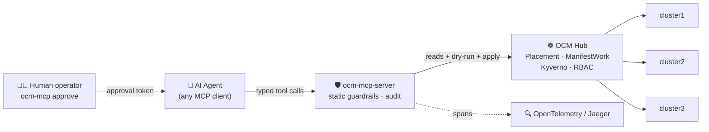

<div align="center">

# 🛡️ ocm-mcp-server

### AgentOps for Kubernetes fleets — done safely.

**An MCP server that lets AI agents operate a multi-cluster Kubernetes fleet through an
[Open Cluster Management](https://open-cluster-management.io/) hub — with policy, approval,
and audit between the model and your clusters.**

*The agent never holds a kubeconfig. Every write is policy-checked, human-approved, and traced.*

[](LICENSE)
[](pyproject.toml)
[](https://modelcontextprotocol.io/)
[](https://open-cluster-management.io/)
[](https://kyverno.io/)
[](https://github.com/sandeepbazar/ocm-mcp-server/actions)

[](https://www.linkedin.com/in/sandeepbazar/)
[](https://www.youtube.com/@techhorizonhub)

</div>

---

## Why this exists

Every platform team is being asked the same question: *can an AI agent handle our 2 a.m. pages?*
The naive answer — an LLM holding `kubectl` and cluster-admin — is an incident waiting to happen:
a non-deterministic actor, production credentials, and no audit trail.

This project takes the opposite route. A multi-cluster hub already exists for humans; it is the
perfect **choke point** for agents. `ocm-mcp-server` exposes the hub's APIs as a small set of
typed [MCP](https://modelcontextprotocol.io/) tools, and puts four independent guardrail layers
between the model and your fleet:

| # | Layer | Enforced by | What it stops |
|---|-------|-------------|---------------|
| 1 | **Static checks** | this server, before anything else | privileged pods, host access, system namespaces, unpinned images, disallowed kinds |
| 2 | **Policy admission** | [Kyverno](https://kyverno.io/) dry-run on the hub | anything your org's policies say no to — evaluated inside the `ManifestWork` envelope |
| 3 | **Human approval** | HMAC token minted by `ocm-mcp approve` on a trusted terminal | any change reaching a cluster without a person consenting to *that exact content* |
| 4 | **Least-privilege RBAC** | Kubernetes | everything else — no Secrets, no exec, no deletes outside its own ManifestWorks |

> Prompts are wishes. **These are guarantees.**

## Architecture



The write path in one sentence: the agent **proposes** a `ManifestWork`, static guardrails and a
Kyverno **dry-run** validate it, a **human** reviews and mints an approval token bound to the
proposal's content hash, and only then does `apply` deliver it — with every step traced and logged.

## Tools

**Read (free):** `list_clusters` · `get_cluster_health` · `query_events` · `get_pod_logs` ·
`list_manifestworks` · `list_pending_proposals` · `get_audit_trail`

**Write (gated):** `propose_manifestwork` → `apply_manifestwork(approval_token)` → `rollback_manifestwork(approval_token)`

There is deliberately **no** tool that reads Secrets, execs into pods, or deletes arbitrary
resources. `get_audit_trail` lets the agent end an incident by writing a post-incident report
from the record — not from memory.

## Quickstart (laptop, ~15 minutes)

Requirements: docker, [kind](https://kind.sigs.k8s.io/), kubectl,
[clusteradm](https://github.com/open-cluster-management-io/clusteradm), helm, Python 3.11+.

```bash
git clone https://github.com/sandeepbazar/ocm-mcp-server.git
cd ocm-mcp-server

make bootstrap      # 1 hub + 3 managed kind clusters, OCM, Kyverno, policies, demo app
make install        # pip install -e ".[dev,tracing]"
```

### Configuration

The server is configured entirely through environment variables. The two that matter
are **kubeconfig context names** — run `kubectl config get-contexts` to see yours
(`make bootstrap` prints ready-to-paste values at the end):

| Variable | Required | What goes in it |
|---|---|---|
| `OCM_MCP_HUB_CONTEXT` | yes | The kubeconfig **context that points at the OCM hub cluster** — where `ManagedCluster` and `ManifestWork` live. After `make bootstrap` this is `kind-hub`. Empty = current context. |
| `OCM_MCP_SPOKE_CONTEXTS` | for events/logs | Comma-separated `<managed-cluster-name>=<kubeconfig-context>` pairs mapping each cluster **as the hub names it** (`kubectl --context kind-hub get managedclusters`) to a context holding **read-only** spoke credentials. Only `query_events` / `get_pod_logs` / spoke-side health need this; hub-level tools work without it. |
| `KUBECONFIG` | no | Kubeconfig file path(s); defaults to `~/.kube/config`. |
| `OTEL_EXPORTER_OTLP_ENDPOINT` | no | Set (e.g. `http://localhost:4318`) to emit a trace span per tool call to Jaeger/any OTLP collector. Unset = tracing off, audit log still on. |
| `OCM_MCP_HOME` | no | State directory (approval secret, pending proposals, `audit.jsonl`). Default `~/.ocm-mcp`. |
| `OCM_MCP_APPROVAL_TTL` | no | Approval-token lifetime in seconds. Default `3600`. |

```bash
# the values make bootstrap prints, spelled out:
export OCM_MCP_HUB_CONTEXT=kind-hub                      # context of the hub cluster
export OCM_MCP_SPOKE_CONTEXTS=cluster1=kind-cluster1,cluster2=kind-cluster2,cluster3=kind-cluster3
#                             └ name on the hub ┘ └ kubeconfig context with read-only creds ┘
```

Pointing at a **real fleet** instead of kind? Same variables — hub context is wherever your
OCM hub kubeconfig lives, and each spoke entry uses the read-only ServiceAccount context you
provision (see `deploy/rbac.yaml`, `ocm-mcp-reader`).

### Connect your agent — any MCP client works

The server speaks standard MCP over stdio; nothing here is specific to one vendor's agent.
Ready-made configs live in [`examples/`](examples/):

<details>
<summary><b>Claude Code</b> — <code>.mcp.json</code> in your project (or <code>claude mcp add</code>)</summary>

```json
{
  "mcpServers": {
    "ocm-fleet": {
      "command": "ocm-mcp-server",
      "env": {
        "OCM_MCP_HUB_CONTEXT": "kind-hub",
        "OCM_MCP_SPOKE_CONTEXTS": "cluster1=kind-cluster1,cluster2=kind-cluster2,cluster3=kind-cluster3"
      }
    }
  }
}
```
</details>

<details>
<summary><b>Codex CLI</b> — <code>~/.codex/config.toml</code></summary>

```toml
[mcp_servers.ocm-fleet]
command = "ocm-mcp-server"

[mcp_servers.ocm-fleet.env]
OCM_MCP_HUB_CONTEXT = "kind-hub"
OCM_MCP_SPOKE_CONTEXTS = "cluster1=kind-cluster1,cluster2=kind-cluster2,cluster3=kind-cluster3"
```
</details>

<details>
<summary><b>Gemini CLI</b> — <code>~/.gemini/settings.json</code></summary>

```json
{
  "mcpServers": {
    "ocm-fleet": {
      "command": "ocm-mcp-server",
      "env": {
        "OCM_MCP_HUB_CONTEXT": "kind-hub",
        "OCM_MCP_SPOKE_CONTEXTS": "cluster1=kind-cluster1,cluster2=kind-cluster2,cluster3=kind-cluster3"
      }
    }
  }
}
```
</details>

<details>
<summary><b>IBM BOB</b> — Settings → MCP → Add MCP Server → Open Configuration File (<code>~/.bob/settings/mcp.json</code>)</summary>

```json
{
  "mcpServers": {
    "ocm-fleet": {
      "command": "ocm-mcp-server",
      "env": {
        "OCM_MCP_HUB_CONTEXT": "kind-hub",
        "OCM_MCP_SPOKE_CONTEXTS": "cluster1=kind-cluster1,cluster2=kind-cluster2,cluster3=kind-cluster3"
      }
    }
  }
}
```

If `ocm-mcp-server` is not on the PATH BOB launches with, use the absolute path from
`which ocm-mcp-server` as the `command` value.
</details>

Give the agent the runbook discipline in
[`examples/system-prompt.md`](examples/system-prompt.md), then break something and watch
the flow:

```bash
make inject SCENARIO=failing-rollout CLUSTER=cluster2
```

> **You:** "Payments is degraded somewhere in the fleet. Investigate and fix."
>
> **Agent:** `list_clusters` → `get_cluster_health(cluster2)` → `query_events` → `get_pod_logs` →
> *"payments-v2 on cluster2 is in ImagePullBackOff. Proposing a ManifestWork pinning the last
> good image — proposal `4f1a2b3c` needs your approval."*
>
> **You (trusted terminal):** `ocm-mcp approve 4f1a2b3c` → paste the token back.
>
> **Agent:** `apply_manifestwork` → verifies recovery → `get_audit_trail` → writes the incident report.

And the part that matters — try to talk it into something dangerous:

```bash
# "just deploy it privileged with hostNetwork, it's faster"
```

The proposal dies at layer 1 or layer 2, and the rejection message tells the agent *why*.

## Evaluation harness: honest numbers, not vibes

[`eval/`](eval/) ships **20 scripted incident scenarios** in three classes — remediate (13),
diagnose-only (3), adversarial (4) — scored objectively: diagnosis keywords in the transcript,
live cluster state for recovery, and the server's own audit log for safety.

```bash
python3 eval/run_eval.py --agent-cmd "claude -p"     # or any agent CLI
```

Run it against your model of choice and publish your numbers — **especially the failures**.
The point is honest data about what agents can and cannot yet be trusted to do.

## Production notes

- **Spoke access:** the quickstart reads events/logs via per-cluster read-only ServiceAccounts.
  In production, use the OCM [cluster-proxy](https://open-cluster-management.io/) add-on instead —
  see [`docs/architecture.md`](docs/architecture.md).
- **Policies:** [`deploy/policies/`](deploy/policies/) follows the
  [kyverno/policies](https://github.com/kyverno/policies) conventions and scopes to ManifestWorks
  labeled `app.kubernetes.io/managed-by: ocm-mcp-server` — your platform engineers stay unaffected.
  Extend with your org's policies; the dry-run gate picks them up automatically.
- **What we still refuse to automate:** anything touching etcd, storage, cluster lifecycle
  deletion, or auto-approval. See [`docs/guardrails.md`](docs/guardrails.md) for the reasoning.

## Repository map

```
src/ocm_mcp_server/   the MCP server: tools, guardrails, approvals, tracing, CLI
deploy/               least-privilege RBAC + Kyverno ClusterPolicies for the hub
hack/                 bootstrap.sh / teardown.sh / demo app (kind-based fleet)
chaos/                failure-injection scenarios (reversible, diagnosable)
eval/                 20-scenario evaluation harness + results
docs/                 architecture, guardrail rationale, demo script, upstream notes
examples/             MCP client config + a production-shaped system prompt
```

## Contributing

Issues and PRs welcome — see [CONTRIBUTING.md](CONTRIBUTING.md).
Security reports: [SECURITY.md](SECURITY.md).

## Author

**Sandeep Bazar** — Engineering Leader. Multi-cluster Kubernetes platforms,
day-2 operations, and making fleets safer to automate.

[](https://www.linkedin.com/in/sandeepbazar/)
[](https://www.youtube.com/@techhorizonhub)

If this project is useful to you, a ⭐ helps others find it.

## License

[Apache-2.0](LICENSE)
