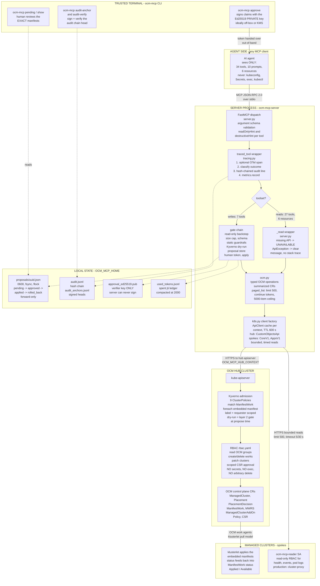
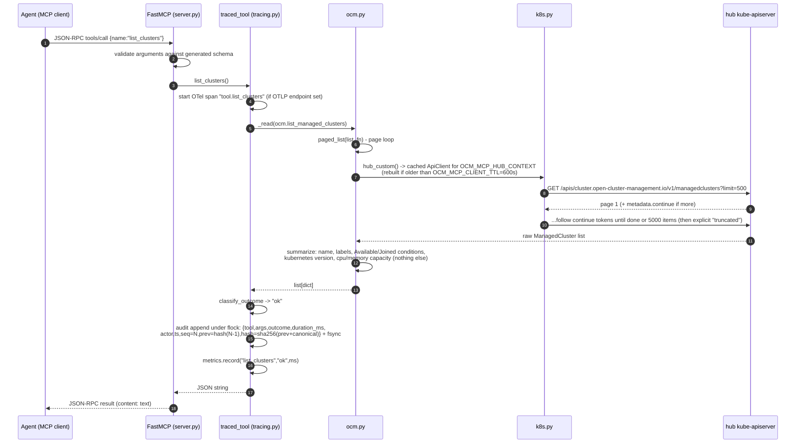
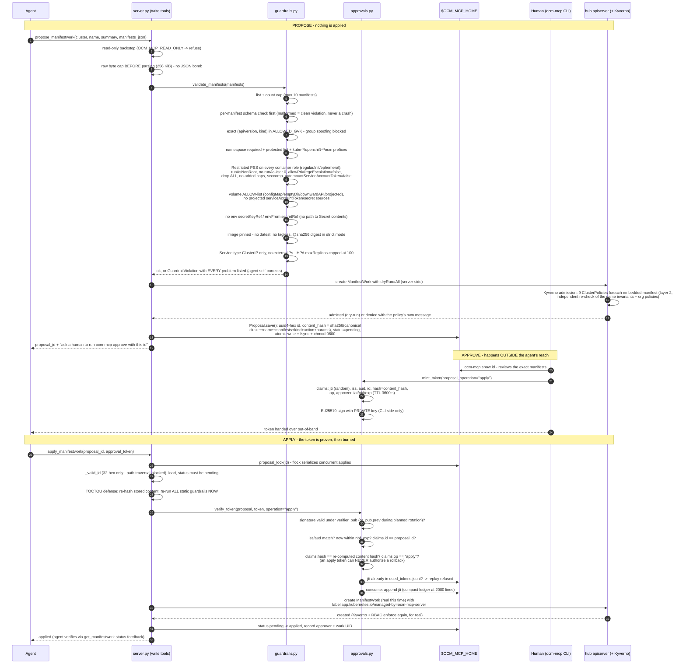
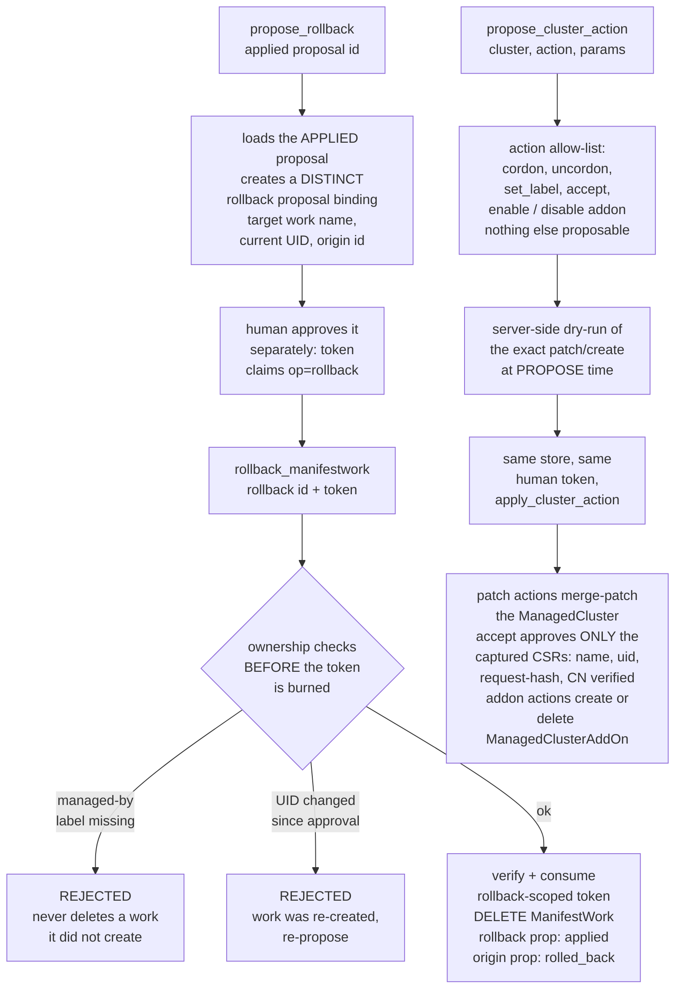
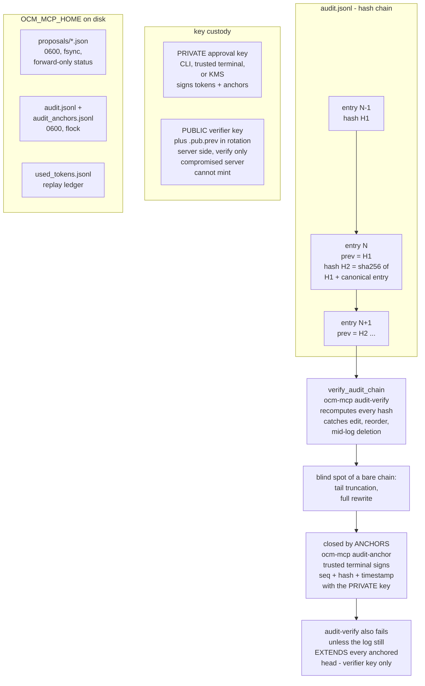

# Architecture

## The choke-point idea

Fleet operations already flow through a hub: Open Cluster Management gives us
cluster inventory (`ManagedCluster`), scheduling (`Placement`), and delivery
(`ManifestWork`). Instead of handing an agent N kubeconfigs, we hand it a
narrow, typed view of that hub - one place to observe, one place to constrain.

```
agent (any MCP client)
   │  typed MCP tools
   ▼
ocm-mcp-server ──── audit.jsonl (every call)
   │                 └─ OTel spans → Jaeger
   │ static guardrails (layer 1)
   ▼
OCM hub API
   │ Kyverno admission, incl. dry-run   (layer 2)
   │ human approval token               (layer 3)
   │ least-privilege RBAC               (layer 4)
   ▼
ManifestWork → work agent on each managed cluster
```

## Components

| Component | Role |
|---|---|
| `server.py` | FastMCP server; the only surface the agent sees |
| `ocm.py` | ManagedCluster / ManifestWork operations, summarized for agents |
| `guardrails.py` | layer-1 static checks (exact GVK allow-list, namespaces, Restricted Pod Security, volume/service allow-lists, image pinning, per-proposal limits) |
| `approvals.py` | proposal store + one-time Ed25519 approval tokens binding the content hash, operation, issuer/audience, and TTL (server holds only the public key) |
| `tracing.py` | OTel span + hash-chained audit line per tool call |
| `metrics.py` | optional Prometheus `/metrics` endpoint |
| `filelock.py` | advisory file locks (atomic proposal writes, spent-token ledger, per-proposal apply lock) |
| `cli.py` | `ocm-mcp` - the human approval terminal (approve/reject/audit-verify/doctor/rotate-secret) |
| `deploy/policies/` | Kyverno ClusterPolicies validating **inside** the ManifestWork envelope |
| `deploy/rbac.yaml` | hub ServiceAccount: read across the OCM API (cluster/placement/addon/operator/policy/HyperShift/ManagedClusterInfo), create/delete ManifestWorks and add-ons, patch ManagedClusters, approve OCM join CSRs. No Secret reads, no exec, no arbitrary delete. Ownership of a work is enforced in-app, not by RBAC |

## Low-level design - the full internals, vertically

Everything below is the same system, cut four ways: the full component stack, the
anatomy of one read call, the complete gated write sequence, and the integrity
machinery (state, keys, audit). File references are to `src/ocm_mcp_server/`.

### 1. The full vertical stack

Every box is a real component; every arrow is a real call path or protocol.



### 2. Anatomy of one read call - `list_clusters`

What actually happens, function by function, for the simplest tool:



Spoke-touching reads (`get_cluster_health`, `query_events`, `get_pod_logs`) differ
in one step: `k8s.spoke_core(cluster)` resolves the per-cluster read context and
every list is bounded (`limit=OCM_MCP_HEALTH_LIMIT`, request timeout `(5, 30)`s),
with an explicit note when the cluster has more than the limit.

### 3. The gated write path - every check, in order

Nothing in this sequence is advisory; each numbered gate refuses on its own.



### 4. Rollback and lifecycle actions - the same gate, different verbs



### 5. Integrity machinery - audit chain, anchors, keys, state



### 6. Where each guarantee is enforced (quick index)

| Guarantee | Enforced in | Independent backstop |
|---|---|---|
| Only 8 exact GVKs enter a proposal | `guardrails.py` `ALLOWED_GVK` | Kyverno `restrict-manifestwork-gvk` |
| No system/platform namespaces | `guardrails.py` prefixes | Kyverno `protect-system-namespaces` (wildcards) |
| Restricted Pod Security incl. init/ephemeral, no uid 0 | `guardrails._check_pod_security` | Kyverno `restrict-manifestwork-pod-security` |
| No path to Secret contents (env/volume/projected) | `guardrails.py` | Kyverno `disallow-manifestwork-secret-access` |
| ClusterIP-only Services, HPA ceiling | `guardrails.py` | Kyverno `restrict-manifestwork-service-hpa` |
| Pinned images, kind allow-list | `guardrails.py` | Kyverno `restrict-manifestwork-kinds` |
| <= 10 manifests, <= 256 KiB | `guardrails.py` / `server.py` | Kyverno `limit-manifestwork-manifests` |
| Change needs a human | `approvals.verify_token` (sig, hash, op, jti, TTL) | RBAC: server cannot escalate |
| Approval binds exact content | content hash in claims + TOCTOU re-hash at apply | signature breaks on any mutation |
| Every call on the record | `traced_tool` hash chain | signed anchors catch truncation |
| The two layers agree | `hack/parity_contract.py` in CI | 39-case offline `kyverno test` |

The parity between the left and middle columns is not aspirational: CI runs the same
fixture corpus through both layers and fails on any verdict mismatch.

## Design decisions worth arguing about

**Why validate ManifestWorks, not Pods?** Policies on the managed clusters see
resources only after delivery. Validating the *envelope* on the hub rejects bad
content before it ever leaves - at proposal time, via server-side dry-run, so
the agent gets the policy message as feedback and can self-correct.

**Why an Ed25519-signed token instead of a "yes" in chat?** A chat approval
approves a *conversation*. The token approves a *content hash* and an operation:
if the agent mutates the proposal after approval, the signature no longer
verifies, and an `apply` token cannot authorize a `rollback`. Approval is
asymmetric - the CLI signs with a private key the server never holds, so a
compromised server cannot mint one - provided the private signing key is kept off the
server (`OCM_MCP_SIGNER_KEY` on a separate account/device); co-located, that is a
filesystem convention, not a boundary. Tokens are single-use and expire (default 1 h), minted
only by the CLI on a trusted terminal.

**Why per-spoke read ServiceAccounts in the quickstart?** Simplicity. The
production-correct path is the OCM cluster-proxy add-on (hub-mediated access,
no direct spoke credentials on the server host); the tool surface is identical,
so swapping the transport does not change the agent's world.

**Why no Secrets/exec tools at all?** Any tool that exists will eventually be
called. Capabilities that are absent cannot be prompt-injected into use.

## Scaling the pattern

- More clusters: nothing changes - the hub is the fan-out point.
- More agents: one server per agent identity, each with its own RBAC and audit.
- Other hubs: the guardrail pattern (static → policy dry-run → human token →
  RBAC) ports to any declarative delivery API, not just OCM.
