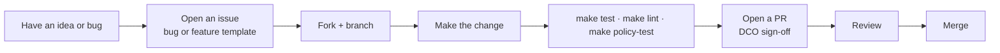

# 10. Contributing

Help is welcome, and the project is deliberately structured so that
contributions are easy to review and hard to make unsafe.



## Good first contributions

- **A new chaos scenario** in `chaos/scenarios/` plus its eval entry. Small,
  self-contained, and directly useful.
- **A policy** in `deploy/policies/` with test cases in
  `deploy/policies/tests/`, following the kyverno/policies conventions.
- **Docs**: clarify a page, add a client example, improve the deployment guide.
- **Run the eval harness** against a model and contribute the results.

## Ground rules

- **The small tool surface is a feature.** A new MCP tool needs a written
  rationale: why it is safe to expose and which guardrail layers cover it.
  "It would be convenient" is not enough.
- **Every write-path change needs tests** for the guardrail and approval
  behavior it touches.
- **Policies** follow the
  [kyverno/policies](https://github.com/kyverno/policies) conventions:
  descriptive names, `policies.kyverno.io/*` annotations, one concern per policy,
  test cases included.

## Local workflow

```bash
make install       # editable install with dev + tracing extras
make test          # unit tests, no cluster
make lint          # ruff
make policy-test   # offline Kyverno CLI tests
make bootstrap     # full local fleet, for end-to-end work
```

## Commit and PR conventions

- Conventional-style subjects: `feat:`, `fix:`, `docs:`, `test:`, `chore:`.
- Sign off every commit (`git commit -s`, DCO). No other trailers. This is enforced:
  the `dco` job fails a pull request whose commits lack the trailer.
- Signing commits is separate from signing off, and both are wanted. See
  [CONTRIBUTING.md](https://github.com/ocm-mcp-server/ocm-mcp-server/blob/main/CONTRIBUTING.md)
  for the SSH signing setup that produces GitHub's Verified badge.
- One logical change per commit; keep diffs reviewable.
- The PR template includes a checklist; new tools must include the safety
  rationale.

Full detail:
[CONTRIBUTING.md](https://github.com/ocm-mcp-server/ocm-mcp-server/blob/main/CONTRIBUTING.md)
and the [Code of Conduct](https://github.com/ocm-mcp-server/ocm-mcp-server/blob/main/CODE_OF_CONDUCT.md).

## Security and sponsorship

- Security issues go through
  [private advisories](https://github.com/ocm-mcp-server/ocm-mcp-server/security/advisories/new),
  never public issues. See
  [SECURITY.md](https://github.com/ocm-mcp-server/ocm-mcp-server/blob/main/SECURITY.md).
- For commercial support, a hardened deployment review, sponsored features, or
  talks and workshops, connect on [LinkedIn](https://www.linkedin.com/in/sandeepbazar/)
  ([SUPPORT.md](https://github.com/ocm-mcp-server/ocm-mcp-server/blob/main/SUPPORT.md)).

Next: [FAQ](FAQ).
