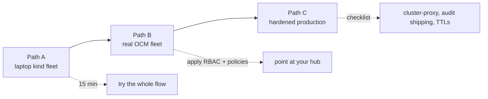

# 6. Getting Started

Three paths, from "try it on a laptop" to "run it against production." Full
commands live in the
[deployment guide](https://github.com/sandeepbazar/ocm-mcp-server/blob/main/docs/deployment.md);
this page is the shape of the journey.



## Path A: laptop fleet (about 15 minutes)

```bash
git clone https://github.com/sandeepbazar/ocm-mcp-server.git
cd ocm-mcp-server
make bootstrap     # 1 hub + 3 kind clusters, OCM, Kyverno, policies, demo app
make install
```

`make bootstrap` prints the exact environment to export. Register the server
with your MCP client (Claude Code, Codex CLI, Gemini CLI, or IBM BOB, all in
[`examples/`](https://github.com/sandeepbazar/ocm-mcp-server/tree/main/examples)),
then run the smoke test:

```bash
make inject SCENARIO=failing-rollout CLUSTER=cluster2
# then ask your agent: "Payments is degraded somewhere in the fleet. Fix it."
```

Walk through the whole conversation, including approval, in
[Use Cases and Impact](Use-Cases-and-Impact) and the
[worked examples](https://github.com/sandeepbazar/ocm-mcp-server/blob/main/docs/examples.md).

## Path B: an existing OCM fleet

Works with any conformant hub. Apply the identity and policies, wire read-only
spoke access, point the server at your hub context:

```bash
kubectl --context <hub> apply -f deploy/rbac.yaml
kubectl --context <hub> apply -f deploy/policies/
export OCM_MCP_HUB_CONTEXT=<hub>
export OCM_MCP_SPOKE_CONTEXTS=prod-tokyo=prod-tokyo-reader,...
ocm-mcp-server
```

## Path C: hardened production

The deployment guide has the full checklist. The essentials: swap direct spoke
contexts for the OCM cluster-proxy add-on, one server + hub identity per agent,
`OCM_MCP_HOME` on encrypted disk, ship `audit.jsonl` to your log pipeline, set
an OTLP endpoint, and tune the approval TTL to your change windows.

## Configuration reference

| Variable | Meaning |
|---|---|
| `OCM_MCP_HUB_CONTEXT` | kubeconfig context of the hub cluster |
| `OCM_MCP_SPOKE_CONTEXTS` | `name=context,...` read-only spoke access for events/logs |
| `OTEL_EXPORTER_OTLP_ENDPOINT` | optional tracing collector |
| `OCM_MCP_HOME` | state dir (secret, proposals, audit); default `~/.ocm-mcp` |
| `OCM_MCP_APPROVAL_TTL` | approval token lifetime, seconds; default 3600 |

Next: [Use Cases and Impact](Use-Cases-and-Impact).
