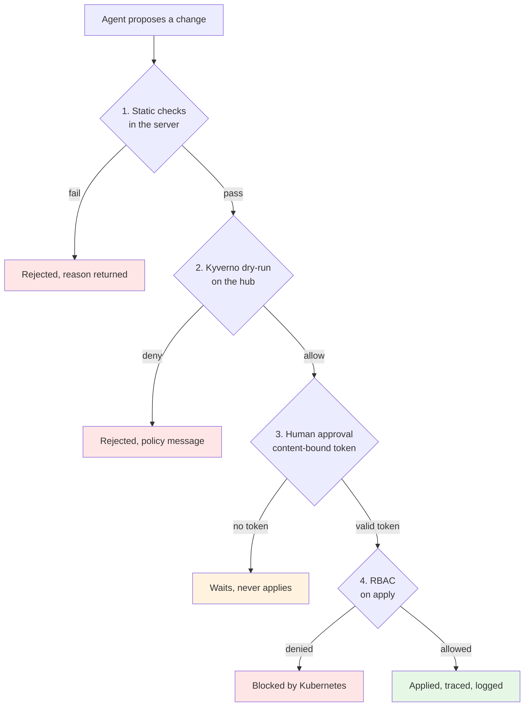
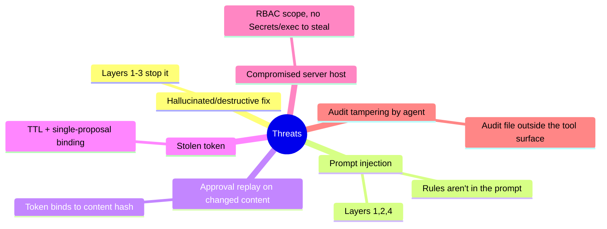

# 5. Guardrails Deep Dive

Four independent layers stand between the model and your clusters. A change must
pass all four, in order. The point of four layers is that each fails
differently, so a gap in one is caught by the next.

## Layer 1: static checks (fast, local)

Runs in the server before anything else, with no cluster round-trip, so the
agent gets instant, specific feedback. Blocks privileged/host settings,
protected namespaces, disallowed kinds, and unpinned images. See
[Implementation](Implementation) for the full list.

## Layer 2: Kyverno policy admission

The three policies in `deploy/policies/` validate the workload *inside* the
`ManifestWork` envelope using Kyverno's `foreach` over
`spec.workload.manifests`. This matters: normal pod-security policies only see
resources after they land on a cluster. Here we validate on the hub, at propose
time, via server-side **dry-run**, so bad content is rejected before it is ever
delivered, and the agent gets the policy message to self-correct.

The policies are scoped by the label
`app.kubernetes.io/managed-by: ocm-mcp-server`, so human platform engineers are
not affected. They ship with an offline CLI test suite
(`make policy-test`, 12 cases) that runs in CI.

Because it is just [Kyverno](https://kyverno.io/docs/introduction/) - a CNCF policy
engine whose policies are ordinary Kubernetes resources in YAML and CEL, enforced by
the cluster rather than by the prompt - your existing organizational policies apply
here too with no extra wiring. And you do not have to write them from scratch: the
community library [kyverno/policies](https://github.com/kyverno/policies) and the
searchable [Kyverno Policies catalog](https://kyverno.io/policies/) are a ready source
of validation, Pod Security Standards, and best-practice policies to adopt or adapt.

## Layer 3: human approval (content-bound)

An **Ed25519-signed** token whose claims bind the proposal's content hash, the
operation (`apply` or `rollback`), and an expiry. It approves *that exact change*,
not a conversation. Approval is asymmetric: the CLI holds the private signing key
and the server only the public key, so the server can verify a token but can never
mint one. Minted only by the `ocm-mcp` CLI on a trusted terminal. See
[How It Works](How-It-Works) for the token mechanics.

## Layer 4: least-privilege RBAC

The server's hub identity can read ManagedClusters and create/delete only its
own ManifestWorks. It cannot read Secrets, exec, or touch anything else. Even a
bug in the server cannot exceed this. This is the backstop that holds when the
other three are somehow bypassed.

## Deliberate absences

There is no tool for: reading Secrets, exec/port-forward, deleting arbitrary
resources, cluster lifecycle operations, or approving proposals. A capability
that does not exist cannot be prompt-injected into use. This is a design choice,
not an oversight.

## Threat model

## What we refuse to automate, for now

- anything touching etcd, storage classes, or cluster deletion;
- cross-cluster traffic shifting during a live incident;
- auto-approval, even for "safe" change classes.

The rule of thumb, stated once more: automate diagnosis aggressively, mutation
conservatively.

Next: [Getting Started](Getting-Started).
