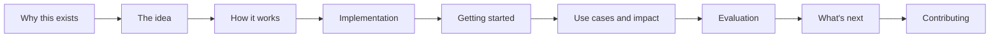

# ocm-mcp-server Wiki

**AgentOps for Kubernetes fleets, done safely.**

This wiki is the guided tour: the whole journey from the problem, through the
idea and the design, to running it, improving it, and helping build it. If you
just want to install and go, the [README](https://github.com/sandeepbazar/ocm-mcp-server)
is faster. If you want to understand *why it is built this way*, start here.

## Read in order

1. **[Why This Exists](Why-This-Exists)** - the 2 a.m. problem and why the obvious answer fails
2. **[The Idea](The-Idea)** - the hub as a safe control point for agents
3. **[How It Works](How-It-Works)** - architecture and the request/approval workflow
4. **[Implementation](Implementation)** - what is actually in the code, module by module
5. **[Guardrails Deep Dive](Guardrails-Deep-Dive)** - the four layers and the threat model
6. **[Getting Started](Getting-Started)** - laptop fleet to production, step by step
7. **[Use Cases and Impact](Use-Cases-and-Impact)** - who this helps and how much
8. **[Evaluation](Evaluation)** - measuring what agents can and cannot be trusted to do
9. **[What's Next](Roadmap)** - the roadmap and how to shape it
10. **[Contributing](Contributing)** - how to help
11. **[FAQ](FAQ)** - naming, comparisons, common questions

## The one-paragraph version

Your team runs many Kubernetes clusters. People are asking whether an AI agent
can take the on-call load. Handing a model `kubectl` with admin is fast to try
and dangerous in production. This project instead exposes your multi-cluster
hub (Open Cluster Management) to agents as a small set of typed MCP tools, and
puts four independent layers between the model and your clusters: static
checks, Kyverno policy admission, human approval tokens, and least-privilege
RBAC. The agent investigates freely and proposes changes; nothing reaches a
cluster without passing policy and a human. Every action is traced and logged.

---

*Maintained by [Sandeep Bazar](https://www.linkedin.com/in/sandeepbazar/) ·
[YouTube: Tech Horizon Hub](https://www.youtube.com/@techhorizonhub) ·
sponsorship via [LinkedIn](https://www.linkedin.com/in/sandeepbazar/)*
