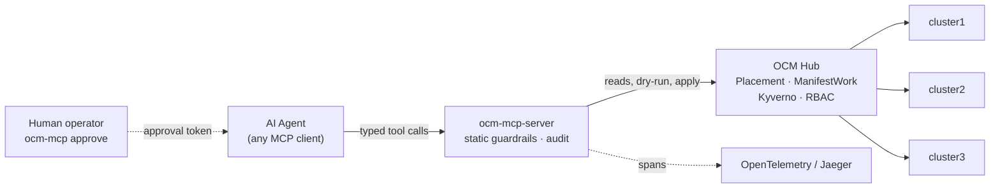
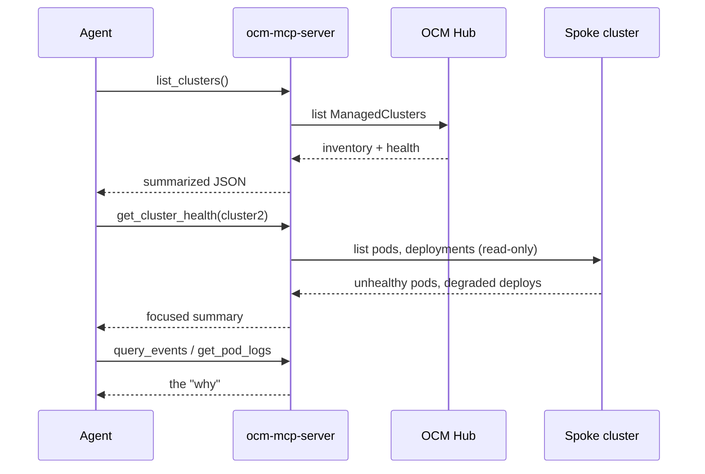

# 3. How It Works

## The whole system in one picture



The agent talks only to the server. The server holds the kubeconfig, applies
static guardrails, writes an audit line and a trace span for every call, and
talks to the hub. The hub enforces Kyverno policy and RBAC. A human, on a
separate trusted terminal, is the only source of approval tokens.


## The read path (free)

Investigation has no gate. The agent can call any read tool as often as it
likes.



Results are summarized, not raw. The agent gets the fields an on-call engineer
would look at, not thousand-line objects that burn context.

## The write path (gated)

This is the heart of the design. Four independent checks, in order.

```mermaid
sequenceDiagram
    participant Ag as Agent
    participant Sv as ocm-mcp-server
    participant Ky as Kyverno (hub)
    participant Hu as Human
    participant Hub as OCM Hub
    Ag->>Sv: propose_manifestwork(cluster, name, summary, manifests)
    Sv->>Sv: 1. static guardrails
    alt fails static checks
        Sv-->>Ag: REJECTED (reason)
    else passes
        Sv->>Ky: 2. dry-run create ManifestWork
        alt policy denies
            Ky-->>Sv: denied (policy message)
            Sv-->>Ag: REJECTED (policy reason)
        else policy allows
            Sv-->>Ag: proposal_id, status pending_approval
            Note over Hu: reviews with ocm-mcp show
            Hu->>Hu: 3. ocm-mcp approve <id> -> token
            Ag->>Sv: apply_manifestwork(id, token)
            Sv->>Sv: verify token vs content hash + TTL
            Sv->>Hub: 4. create ManifestWork (RBAC-scoped)
            Hub-->>Sv: applied
            Sv-->>Ag: applied; verify with reads
        end
    end
```

Read the four checks as defense in depth: each fails differently, so a gap in
one is covered by the others. Details in
[Guardrails Deep Dive](Guardrails-Deep-Dive).

## Why approval is a token, not a chat "yes"

A "yes" in chat approves a conversation. The token approves *content*. It is an
**Ed25519 signature** over claims that bind the proposal's SHA-256 hash, the
operation (`apply` or `rollback`), and an expiry. If the agent changes even one
byte of the proposal after approval, the signature no longer verifies. Approval
is **asymmetric**: the private signing key belongs to the `ocm-mcp` CLI on a
trusted terminal, and the server holds only the public verification key - so it
can check a token but can never mint one, even if it is compromised. Tokens
expire (default one hour) and are minted only by the CLI, never by any tool the
agent can call.

## What the human sees

```
$ ocm-mcp show 4f1a2b3c
id:       4f1a2b3c
cluster:  cluster2
summary:  Pin payments-v2 to the last known-good image (fixes ImagePullBackOff)
manifests:
  - Deployment shop/payments-v2  image: registry.example.com/payments:1.9.2
$ ocm-mcp approve 4f1a2b3c
About to approve on cluster 'cluster2': Pin payments-v2 to the last good image
Approve? [y/N] y
Approval token (give this to the agent):
4f1a2b3c.1753vwxyz.9a1b...
```

Ten seconds to review, one keystroke to consent. That is the human's whole job,
and it is the job that matters.

Next: [Implementation](Implementation).
