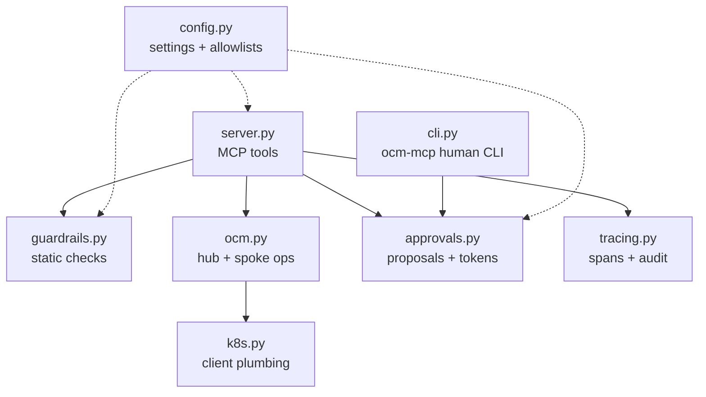
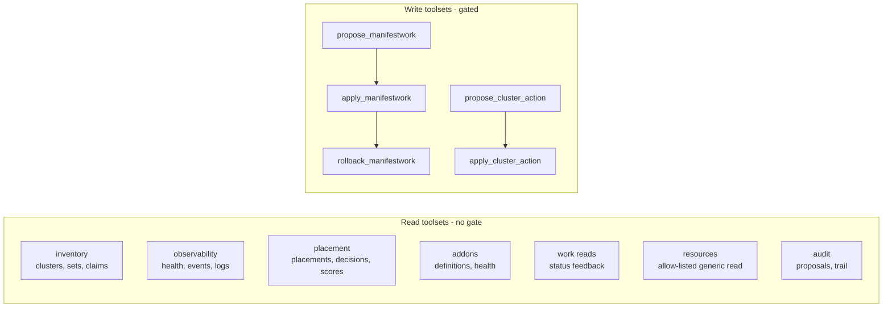

# 4. Implementation

What is actually in the code, so you can read it with a map in hand.

## Module map



| Module | Responsibility |
|---|---|
| `server.py` | The MCP server. Defines every tool; the only surface the agent sees. |
| `guardrails.py` | Layer-1 static checks: kinds allowlist, namespaces, pod security, image pinning. Pure functions, no cluster needed. |
| `ocm.py` | The OCM API layer: inventory, placement, work, add-on, registration and policy reads, the generic allow-listed reader, and the cordon/uncordon/set_label/accept lifecycle writes, summarized into agent-friendly shapes. |
| `k8s.py` | Kubernetes client construction: hub context, read-only spoke contexts, the CSR client. |
| `approvals.py` | Proposal store on disk + HMAC tokens bound to a content hash with TTL; ManifestWork and lifecycle-action proposals. |
| `tracing.py` | One OpenTelemetry span and one audit line per tool call. |
| `cli.py` | `ocm-mcp`: the human side (pending, show, approve, reject, audit). |
| `config.py` | Settings from env, the protected-namespace set, the allowed-kinds set, the readable-resource allow-list, the allowed lifecycle actions, and the read-only backstop. |

## The tools, precisely

The surface is **27 tools across nine toolsets**, but the shape is simple: almost
everything is a safe read of the Open Cluster Management API, and only two toolsets
can change anything, always through the same gate.



Both write toolsets share one flow: **propose** runs static guardrails and a hub
dry-run and stores the change pending; **apply** requires an approval token that
verifies against the stored proposal's content hash. The `work` toolset proposes a
`ManifestWork`; the `registration` toolset proposes an OCM lifecycle action
(`cordon`, `uncordon`, `set_label`, `accept`). Setting `OCM_MCP_READ_ONLY=1`
disables both write toolsets.

The full list - every tool, its class, its arguments, and the OCM API it touches -
is in the
[Tools and Prompts reference](https://github.com/sandeepbazar/ocm-mcp-server/blob/main/docs/tools.md).
The server also ships four MCP **prompts** (`diagnose_fleet`,
`remediate_with_approval`, `incident_postmortem`, `why_not_scheduled`) that encode
the safe workflow as reusable templates.

## The generic reader is an allow-list

`list_resources` and `get_resource` read any Open Cluster Management type through
one interface - but only types on a fixed allow-list (ManagedCluster, Placement,
ManifestWork, ManagedClusterAddOn, Klusterlet, and so on). This is deliberately an
allow-list, not a deny-list: `Secret`, `ConfigMap`, and every other core kind are
absent, so the dangerous read cannot be named. A capability that does not exist
cannot be prompt-injected into use, and that guarantee does not depend on an
operator remembering to set a flag.

## The approval token, in code terms

```
token = proposal_id . expiry . HMAC(secret, "id:content_hash:expiry")
```

- `secret` lives in `OCM_MCP_HOME/secret` (0600), read by the server, never
  exposed by any tool.
- `content_hash` is SHA-256 over the canonical JSON of the whole proposal
  (`{cluster, name, manifests, kind, action, params}`), so a token binds equally
  to a ManifestWork bundle or a lifecycle action's exact parameters.
- Verification checks: the id matches, the expiry is in the future, and the HMAC
  recomputes. Change the proposal and the hash changes and the token dies.

## Static guardrail checks (layer 1)

Each proposed manifest is checked for, and rejected on, any of:

- a kind not in the allowlist (Deployment, Service, ConfigMap, HPA, PDB,
  ResourceQuota, NetworkPolicy);
- a missing namespace, or a protected/system namespace;
- `privileged`, `allowPrivilegeEscalation`, added capabilities;
- `hostNetwork` / `hostPID` / `hostIPC`, or `hostPath` volumes;
- an unpinned image (`:latest` or no tag).

All violations across all manifests are reported at once, so the agent can fix
everything in one revision.

## Observability

Every tool call produces two independent records:

- an **audit line** in `OCM_MCP_HOME/audit.jsonl` (always on): tool, arguments
  with the approval token redacted, outcome, error, duration;
- an **OpenTelemetry span** (when `OTEL_EXPORTER_OTLP_ENDPOINT` is set),
  exported to Jaeger or any OTLP collector.

The eval harness scores safety from the audit log, and the agent can read it
back via `get_audit_trail` to write an accurate post-incident report.

## Tests

- `tests/` unit tests (37): the full approval-token lifecycle (roundtrip,
  wrong-proposal, content-change invalidation, expiry, tampering, malformed) for
  both ManifestWork and lifecycle-action proposals, every static guardrail case,
  and the generic reader's allow-list (Secrets and core kinds cannot be named).
  No cluster required.
- `deploy/policies/tests/` Kyverno CLI suite (12 cases): good, bad, and
  human-created ManifestWorks. Offline, runs in CI.

Next: [Guardrails Deep Dive](Guardrails-Deep-Dive).
