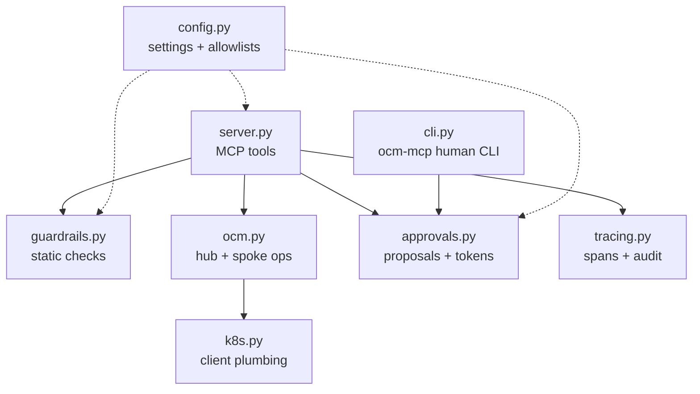
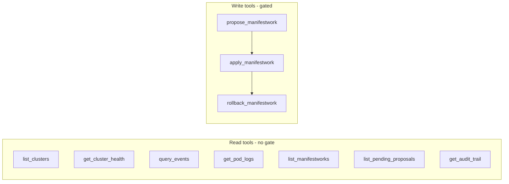

# 4. Implementation

What is actually in the code, so you can read it with a map in hand.

## Module map



| Module | Responsibility |
|---|---|
| `server.py` | The MCP server. Defines every tool; the only surface the agent sees. |
| `guardrails.py` | Layer-1 static checks: kinds allowlist, namespaces, pod security, image pinning. Pure functions, no cluster needed. |
| `ocm.py` | ManagedCluster and ManifestWork operations, summarized into agent-friendly shapes. |
| `k8s.py` | Kubernetes client construction: hub context, read-only spoke contexts. |
| `approvals.py` | Proposal store on disk + HMAC tokens bound to a content hash with TTL. |
| `tracing.py` | One OpenTelemetry span and one audit line per tool call. |
| `cli.py` | `ocm-mcp`: the human side (pending, show, approve, reject, audit). |
| `config.py` | Settings from env, the protected-namespace set, the allowed-kinds set. |

## The tools, precisely



`propose_manifestwork` runs static guardrails, then a Kyverno dry-run on the
hub, then stores the proposal as pending. `apply_manifestwork` and
`rollback_manifestwork` require an approval token that verifies against the
stored proposal's content hash.

## The approval token, in code terms

```
token = proposal_id . expiry . HMAC(secret, "id:content_hash:expiry")
```

- `secret` lives in `OCM_MCP_HOME/secret` (0600), read by the server, never
  exposed by any tool.
- `content_hash` is SHA-256 over the canonical JSON of `{cluster, name, manifests}`.
- Verification checks: the id matches, the expiry is in the future, and the HMAC
  recomputes. Change the proposal and the hash changes and the token dies.

## Static guardrail checks (layer 1)

Each proposed manifest is checked for, and rejected on, any of:

- a kind not in the allowlist (Deployment, Service, ConfigMap, HPA, PDB,
  ResourceQuota, NetworkPolicy);
- a missing namespace, or a protected/system namespace;
- `privileged`, `allowPrivilegeEscalation`, added capabilities;
- `hostNetwork` / `hostPID` / `hostIPC`, or `hostPath` volumes;
- an unpinned image (`:latest` or no tag).

All violations across all manifests are reported at once, so the agent can fix
everything in one revision.

## Observability

Every tool call produces two independent records:

- an **audit line** in `OCM_MCP_HOME/audit.jsonl` (always on): tool, arguments
  with the approval token redacted, outcome, error, duration;
- an **OpenTelemetry span** (when `OTEL_EXPORTER_OTLP_ENDPOINT` is set),
  exported to Jaeger or any OTLP collector.

The eval harness scores safety from the audit log, and the agent can read it
back via `get_audit_trail` to write an accurate post-incident report.

## Tests

- `tests/` unit tests (26): the full approval-token lifecycle (roundtrip,
  wrong-proposal, content-change invalidation, expiry, tampering, malformed)
  and every static guardrail case. No cluster required.
- `deploy/policies/tests/` Kyverno CLI suite (12 cases): good, bad, and
  human-created ManifestWorks. Offline, runs in CI.

Next: [Guardrails Deep Dive](Guardrails-Deep-Dive).
