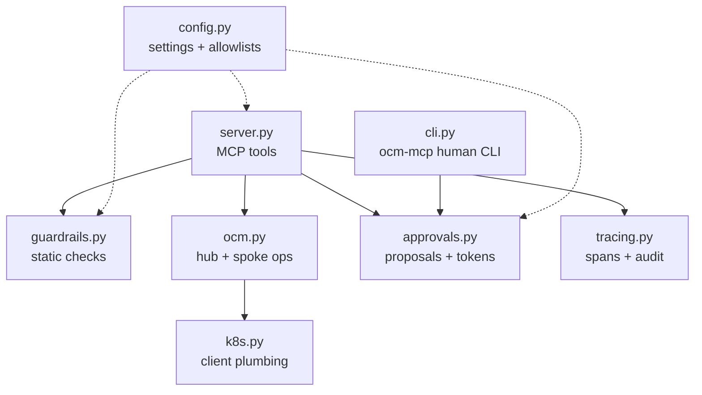
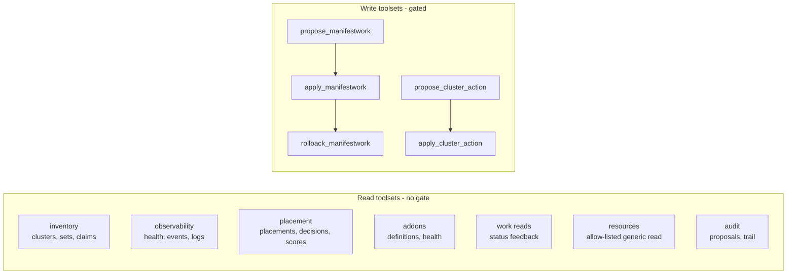

# 4. Implementation

What is actually in the code, so you can read it with a map in hand.

## Module map



| Module | Responsibility |
|---|---|
| `server.py` | The MCP server. Defines every tool; the only surface the agent sees. |
| `guardrails.py` | Layer-1 static checks: exact GVK allow-list, namespaces, a Restricted-Pod-Security baseline (no root/privilege-escalation, drop-ALL, seccomp, no host/Secret/arbitrary-SA, volume + Service allow-lists), image pinning, and per-proposal limits. Pure functions, no cluster needed. |
| `ocm.py` | The OCM API layer: inventory, placement, work, add-on, registration and policy reads, the generic allow-listed reader, and the cordon/uncordon/set_label/accept lifecycle writes, summarized into agent-friendly shapes. |
| `k8s.py` | Kubernetes client construction: hub context, read-only spoke contexts, the CSR client. |
| `approvals.py` | Proposal store on disk + Ed25519 approval tokens whose claims bind the content hash, the operation (`apply`/`rollback`), and a TTL; ManifestWork, lifecycle-action, and rollback proposals. |
| `tracing.py` | One OpenTelemetry span and one hash-chained audit line per tool call (optional stderr echo for a SIEM). |
| `metrics.py` | Optional dependency-free Prometheus `/metrics` endpoint (`OCM_MCP_METRICS_PORT`). |
| `filelock.py` | Advisory file lock behind the atomic proposal writes, the spent-token ledger, and the per-proposal apply lock. |
| `cli.py` | `ocm-mcp`: the human side (pending, show, approve, reject, audit, audit-verify, doctor, rotate-secret). |
| `config.py` | Settings from env, the protected-namespace set, the allowed-kinds set, the readable-resource allow-list, the allowed lifecycle actions, per-proposal limits, and the read-only backstop. |

## The tools, precisely

The surface is **35 tools across ten toolsets**, but the shape is simple: almost
everything is a safe read of the Open Cluster Management API, and only two toolsets
can change anything, always through the same gate.



Both write toolsets share one flow: **propose** runs static guardrails and a hub
dry-run and stores the change pending; **apply** requires an approval token that
verifies against the stored proposal's content hash. The `work` toolset proposes a
`ManifestWork`; the `registration` toolset proposes an OCM lifecycle action
(`cordon`, `uncordon`, `set_label`, `accept`). Setting `OCM_MCP_READ_ONLY=1`
disables both write toolsets.

The full list - every tool, its class, its arguments, and the OCM API it touches -
is in the
[Tools and Prompts reference](https://github.com/sandeepbazar/ocm-mcp-server/blob/main/docs/tools.md).
The server also ships **ten MCP prompts** (from `diagnose_fleet` and
`remediate_with_approval` to `onboard_cluster`, `hosted_cluster_health`, and
`policy_compliance_report`) that encode the safe workflow as reusable templates. Run
`ocm-mcp doctor` to exercise every read tool against a live hub and print a
PASS/EMPTY/SKIP/FAIL table before connecting an agent.

## The generic reader is an allow-list

`list_resources` and `get_resource` read any Open Cluster Management type through
one interface - but only types on a fixed allow-list (ManagedCluster, Placement,
ManifestWork, ManagedClusterAddOn, Klusterlet, and so on). This is deliberately an
allow-list, not a deny-list: `Secret`, `ConfigMap`, and every other core kind are
absent, so the dangerous read cannot be named. A capability that does not exist
cannot be prompt-injected into use, and that guarantee does not depend on an
operator remembering to set a flag.

## The approval token, in code terms

```
claims = {id, hash: content_hash, op: "apply" | "rollback", exp: expiry}
token  = base64(claims_json) . base64(Ed25519_sign(private_key, claims_json))
```

- The **private** signing key lives at `OCM_MCP_HOME/approval_ed25519` (0600) and
  is used only by `ocm-mcp approve` on a trusted terminal. The MCP server loads
  only the **public** key (`approval_ed25519.pub`). The "a compromised server cannot
  mint one" property holds only when the private key is kept off the server - a
  separate account or device via `OCM_MCP_SIGNER_KEY`; co-located under one
  `OCM_MCP_HOME`, signer isolation is a filesystem convention, not a boundary.
- Each token carries a unique id and is **single-use**: verifying it at apply records
  the id as spent (under a lock, fsynced), so the same approval cannot be replayed. It
  also binds an issuer and audience, so a token minted for one deployment cannot be
  used against another.
- `content_hash` is SHA-256 over the canonical JSON of the whole proposal
  (`{cluster, name, manifests, kind, action, params}`), so a token binds equally
  to a ManifestWork bundle, a lifecycle action's exact parameters, or a rollback.
- `op` binds the token to one operation: an `apply` token can never authorize a
  `rollback`, which needs its own proposal and token.
- Verification checks, in order: the Ed25519 signature is valid for the public
  key, the id matches, the content hash matches, the operation matches, and the
  expiry is in the future. Change any byte of the proposal and the signature no
  longer verifies. Rotate the keypair with `ocm-mcp rotate-secret` to invalidate
  every outstanding token at once.

## Static guardrail checks (layer 1)

Inputs are schema-checked first (a malformed manifest is a clean violation, not a
crash), then each manifest is rejected on any of:

- an exact `(apiVersion, kind)` not on the allow-list (blocks group spoofing);
- a missing namespace, or a protected/platform one (`kube-*`, `openshift-*`,
  `open-cluster-management*`, `default`);
- **Restricted Pod Security**, on every container incl. init/ephemeral:
  `automountServiceAccountToken` not `false`, an arbitrary `serviceAccountName`,
  missing `runAsNonRoot`, `runAsUser: 0`, `allowPrivilegeEscalation` not `false`,
  not dropping `ALL` capabilities, added capabilities, `privileged`, or a missing
  seccomp profile;
- `hostNetwork` / `hostPID` / `hostIPC`;
- a volume outside the allow-list (only `configMap`/`emptyDir`/`downwardAPI`/
  projected-without-secrets - so no Secret/hostPath/PVC/CSI/NFS), or an indirect
  Secret env ref;
- a Service that is not `ClusterIP`, or that sets `externalIPs`;
- an unpinned image (`:latest` or no tag; a 64-hex `@sha256` digest when
  `OCM_MCP_REQUIRE_DIGEST` is set);
- a HorizontalPodAutoscaler `maxReplicas` over the cap, or a proposal over the byte
  or 10-manifest limits.

All violations across all manifests are reported at once, so the agent can fix
everything in one revision. The Kyverno layer enforces the same baseline on the hub.

## Observability

Every tool call produces two independent records:

- an **audit line** in `OCM_MCP_HOME/audit.jsonl` (always on): tool, arguments
  with the approval token redacted, outcome, error, duration;
- an **OpenTelemetry span** (when the `[tracing]` extra is installed and
  `OTEL_EXPORTER_OTLP_ENDPOINT` is set), named `tool.<name>` with redacted
  args, exported over OTLP/HTTP to Jaeger or any OTel collector - and
  covered by an e2e step that asserts spans really arrive at an OTLP sink.

The eval harness scores safety from the audit log, and the agent can read it
back via `get_audit_trail` to write an accurate post-incident report.

## Tests

- `tests/` unit tests (403; 100% statement and branch coverage): the full approval-token lifecycle (roundtrip,
  wrong-proposal, content-change invalidation, expiry, tampering, malformed,
  public-key-only verification, operation binding, keypair rotation) for both
  ManifestWork and lifecycle-action proposals, every static guardrail case
  (including GVK spoofing, indirect Secret access, and arbitrary service
  accounts), the generic reader's allow-list (Secrets and core kinds cannot be
  named), the HCP / ManagedClusterInfo / add-on shaping logic, and the hardening
  fixes (apply-time content re-check, robust PodSpec extraction). No cluster
  required.
- `deploy/policies/tests/` Kyverno CLI suite (16 cases): good, bad, and
  human-created ManifestWorks. Offline, runs in CI.

Next: [Guardrails Deep Dive](Guardrails-Deep-Dive).
