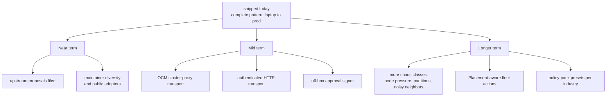

# 9. What's Next

The pattern is complete and runnable today. These are the directions that make
it stronger, roughly in priority order. Several are good first contributions,
see [Contributing](Contributing).

## Near term

- **The remaining upstream proposals.** The Kyverno one is filed:
  [kyverno/policies#1534](https://github.com/kyverno/policies/issues/1534)
  proposes the ManifestWork-envelope pattern to the policy catalog, since nothing
  there demonstrates validating workloads embedded inside another CR. Two drafts
  remain in
  [`docs/upstream-notes.md`](https://github.com/ocm-mcp-server/ocm-mcp-server/blob/main/docs/upstream-notes.md):
  long-running operations in MCP, and richer ManifestWork failure feedback in OCM.
- **Maintainer diversity and public adopters.** These gate CNCF Sandbox and are
  the only steps that cannot be engineered - see
  [CNCF readiness](https://github.com/ocm-mcp-server/ocm-mcp-server/blob/main/docs/cncf-sandbox-readiness.md).

_Shipped: a recorded end-to-end demo in the README, and published evaluation
results across agents from different vendors with the failures called out - see
[Evaluation](Evaluation)._

## Mid term

- **OCM cluster-proxy transport** so the server host never holds spoke
  credentials directly.
- **An authenticated HTTP transport** (SSO/OIDC) so the in-cluster Deployment can
  serve clients standalone rather than over attached stdio.

_Shipped: a signed container image (ghcr.io, SBOM + provenance + Cosign) and a Helm
chart with a Restricted pod, PVC, NetworkPolicy, and PDB._

## Longer term

- **More chaos classes**: node pressure, network partitions, noisy neighbors, to
  broaden what the eval harness covers.
- **Placement-aware fleet actions**: proposals that target a scored subset of
  clusters, not one at a time.
- **Industry policy presets**: ready-made guardrail packs (finance, healthcare)
  layered on top of the base set.

## How this list is chosen

Priorities follow evidence. The eval harness surfaces where agents actually
fail; those failures decide what safety work matters next. If you hit something
the current design cannot express safely,
[open a feature request](https://github.com/ocm-mcp-server/ocm-mcp-server/issues/new/choose)
with the scenario and it becomes a candidate.

Next: [Contributing](Contributing).
