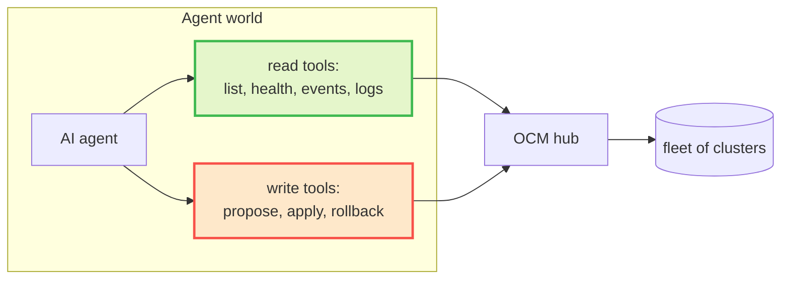

# 2. The Idea

## The hub is the safe control point

Fleets already have a place where multi-cluster actions are observed and
controlled: the hub. [Open Cluster Management](https://open-cluster-management.io/)
(OCM, a CNCF project) gives every fleet three primitives:

| Primitive | What it is | Why it matters here |
|---|---|---|
| `ManagedCluster` | the inventory of clusters registered to the hub | one place to see the whole fleet |
| `Placement` | scheduling: which clusters match a rule | how humans target subsets of the fleet |
| `ManifestWork` | a unit of delivery: manifests wrapped for one cluster | **every change is an object we can inspect and gate** |

The key realization: a change to a cluster, expressed as a `ManifestWork` on
the hub, is a *reviewable object* before it is a running workload. That gives us
a natural place to insert validation and approval.

## Turn the hub into a small, typed tool surface

Instead of handing the agent a kubeconfig, we expose the hub as a handful of
[MCP](https://modelcontextprotocol.io/) tools. MCP (Model Context Protocol) is
the open standard for connecting agents to tools, so any MCP-capable client
works: Claude Code, Codex CLI, Gemini CLI, or your own.

Reads are free. Writes are a three-step, gated path. The agent never touches a
kubeconfig, and the tool surface is deliberately small: there is no tool to read
Secrets, exec into a pod, or delete arbitrary resources. A capability that does
not exist cannot be misused.

## The core principle

> Let the agent think freely. Constrain only what it can *do*, and constrain it
> with mechanisms, not requests.

Investigation is unlimited: look at anything, form any hypothesis, be as clever
as the model allows. Action is narrow and enforced: propose a change, have it
validated by policy, get a human's approval, and only then apply, with a trace
of every step. This split, aggressive on diagnosis and conservative on
mutation, is the whole design in one sentence.

Next: [How It Works](How-It-Works).
