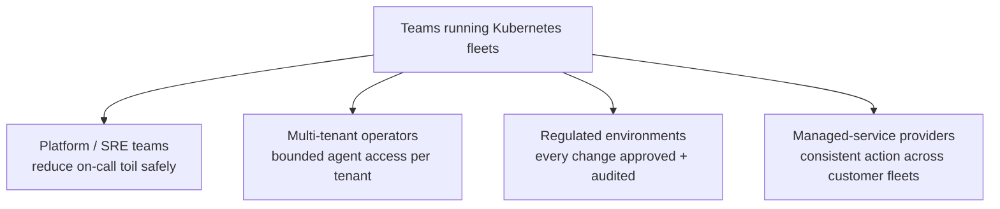
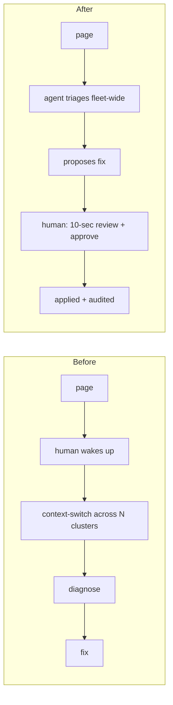

# 7. Use Cases and Impact

## Who this is for

## Concrete use cases

| Situation | What the agent does | What the guardrails guarantee |
|---|---|---|
| **Rollout gone bad** across some clusters | finds the failing rollout, proposes pinning the last good image | no privileged escalation, human confirms the exact image |
| **Crashloop** from a bad config | reads logs, identifies the cause, proposes the corrected spec | change is policy-checked and approved before it lands |
| **Resource pressure** (OOM, quota) | diagnoses the constraint, proposes the adjustment, not a deletion | workload is never deleted to "clear" an error |
| **Silent outage** (scaled to zero) | spots desired=0 with no error events, proposes restoring replicas | approver sees the intended replica count |
| **False alarm** | investigates, reports "healthy, no action" | makes no change at all, which is the correct outcome |
| **Inventory question** | answers "which clusters run X" from the hub | read-only, nothing mutated |

## The impact, honestly stated

This is not "AI replaces your on-call." It is "AI does the first fifteen
minutes of triage across the whole fleet, and proposes the obvious fix, while a
human keeps the veto and the audit trail stays complete."

The value is in the compression of the diagnosis step and the consistency of
the action step, without giving up control or traceability. The
[Evaluation](Evaluation) page is where we put numbers on how well it actually
works, including where it fails.

## Why the pattern generalizes

Nothing here is specific to one company or one workload. The demo app is a
stand-in; the guardrail pattern (static checks, policy dry-run, human token,
RBAC) applies to any Kubernetes estate and, more broadly, to any declarative
delivery API. Teams can adopt the whole thing, or take the pattern and apply it
to their own control plane.

Next: [Evaluation](Evaluation).
