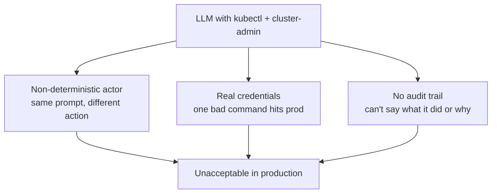

# 1. Why This Exists

## The 2 a.m. question

Every platform team running Kubernetes at scale eventually hears it from
leadership: *can an AI agent handle our on-call load?* The pages are
repetitive, the fixes are often mechanical, and the models are good enough to
read logs. On paper it looks like a solved problem.

The quickest way to try it is also the worst: give a model a kubeconfig with
cluster-admin and let it run `kubectl`. That fails in production for three
independent reasons.

- **The model is non-deterministic.** The same alert can produce a careful
  diagnosis one run and a `kubectl delete` the next.
- **The credentials are real.** There is no dry run between the model's
  decision and your production cluster.
- **There is no record.** When something breaks, you cannot reconstruct what
  the agent did, in what order, or on whose authority.

## Why "just prompt it to be careful" does not work

The common reaction is to write a long system prompt: *never delete anything,
always ask first, avoid kube-system.* Prompts are guidance, not enforcement. A
model can be argued out of a prompt by the next message, by an injected
instruction hidden in a log line, or simply by getting confused. Safety that
lives in the prompt is safety the model can talk itself out of.

## The multi-cluster angle makes it harder, and points at the answer

Real estates are not one cluster. The same incident shows up across dozens of
clusters, slightly different each time. Forty kubeconfigs is forty ways to be
wrong. But fleets already solved the "how do I act across many clusters safely"
problem for humans: they put a **hub** in front of the fleet. That hub is the
insight this project builds on. (Continue to [The Idea](The-Idea).)

## What success looks like

An agent that can:

- investigate a fleet-wide incident quickly, across clusters, read-only;
- propose a specific fix in a reviewable form;
- never move that fix to a cluster without policy validation and a human's yes;
- and leave a complete, replayable record of the whole episode.

That is a system you can actually put on call. Building it is what this project
is about.
